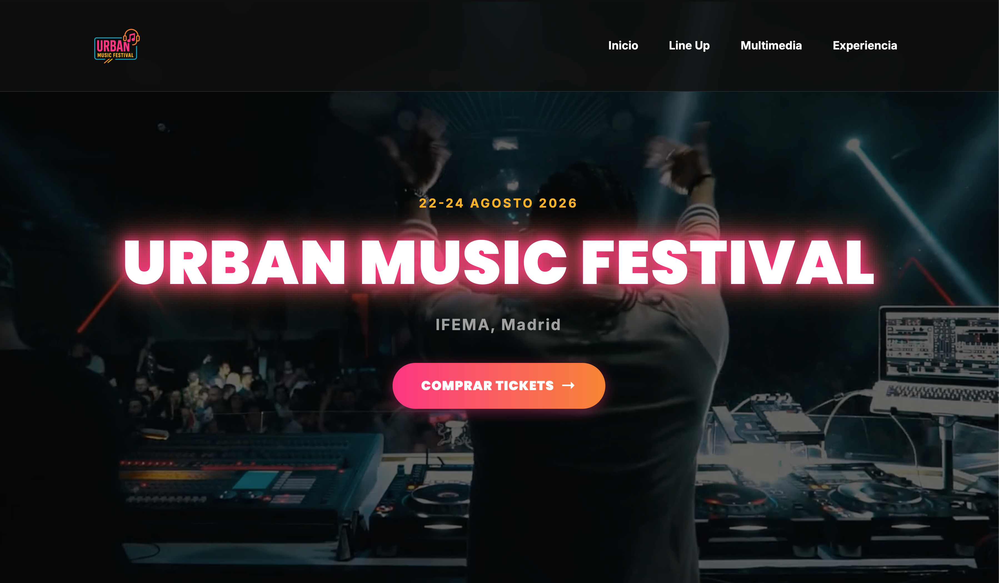

# Urban Music Festival - Proyecto de Diseño de Interfaces Web

Este proyecto es la implementación de un sitio web estático para un festival de música urbana, desarrollado como parte de la evaluación de los Resultados de Aprendizaje 3 y 4 (RA3 y RA4) del módulo de **Diseño de Interfaces Web** del ciclo formativo DAW.

El sitio está diseñado para ser visualmente impactante, moderno y totalmente responsivo, aplicando conceptos avanzados de HTML5 y CSS3 para la integración de contenido multimedia y efectos visuales.

**Ver demo en vivo:** [https://urban-music-festival.vercel.app/](https://urban-music-festival.vercel.app/)



---

## 🚀 Tecnologías Utilizadas

-   **HTML5 Semántico:** Para una estructura clara y accesible.
-   **CSS3 Moderno:**
    -   Variables CSS (Custom Properties) para un temizado eficiente.
    -   Flexbox y Grid para layout responsivo.
    -   Transformaciones, Transiciones y Animaciones para una experiencia dinámica.
-   **Bootstrap 5.3:** Utilizado para el sistema de grid y componentes interactivos como el carrusel de artistas.
-   **Google Fonts:** Para la tipografía (`Poppins` e `Inter`).
-   **Font Awesome:** Para los iconos.

---

## ✅ Cumplimiento de los Requisitos de la Práctica

A continuación se detalla cómo el proyecto cumple con cada uno de los puntos especificados en el enunciado de la práctica.

### RA3 - Preparación de Archivos Multimedia

Aunque esta parte se documenta principalmente en una memoria externa, el proyecto utiliza los recursos preparados según las directrices:

-   **(1a) Logo con Transparencia:** Se ha utilizado `img/logo.png`, un archivo en formato PNG que permite un fondo transparente para una integración limpia sobre cualquier fondo.
-   **(1b) Imágenes para Carrusel:** Las imágenes `img/artista1.jpg`, `img/artista2.jpg` y `img/artista3.jpg` fueron procesadas para tener proporciones y dimensiones similares, garantizando una experiencia visual consistente en el carrusel.
-   **(2a) Pista de Audio:** Se incluye el archivo `audio/musica_festival.mp3`, elegido por su alta compatibilidad con todos los navegadores modernos y una buena relación compresión/calidad.
-   **(2b) Fragmentos de Vídeo:** Se utilizan `video/teaser_festival.mp4` (fondo) y `video/festival.mp4`. El formato MP4 (H.264) es el estándar de facto para la web, asegurando máxima compatibilidad y rendimiento.
-   **(4) Licencias:** Se ha incluido una sección de licencias al final de este README para referenciar el origen y tipo de licencia de cada recurso.

---

### RA4 - Integración de Contenido Multimedia en el Código

-   **(1) Carrusel de Imágenes (`1 pto.`):**
    -   **Implementación:** Se ha utilizado el componente **Carousel de Bootstrap 5** en la sección "Cartel Estelar" (`id="artistas"`).
    -   **Código:** El carrusel está estructurado dentro del `div` con `id="carruselArtistas"` en el archivo `index.html`.

-   **(2) Audio y Vídeo con HTML5 (`2 ptos.`):**
    -   **Implementación:** En la sección "Multimedia" (`id="multimedia"`), se han insertado un audio y un vídeo utilizando las etiquetas `<audio>` y `<video>` de HTML5.
    -   **Código y Atributos:**
        -   **Audio:** `<audio controls loop src="audio/musica_festival.mp3">`
            -   `controls`: Atributo específico que muestra los controles de reproducción nativos del navegador.
            -   `loop`: Atributo específico que hace que el audio se repita indefinidamente.
        -   **Vídeo (Hero):** `<video playsinline autoplay muted loop poster="..." src="video/teaser_festival.mp4">`
            -   `autoplay muted loop`: Una combinación de atributos que permite una reproducción automática de fondo (requiere `muted` en la mayoría de navegadores).
            -   `playsinline`: Atributo clave para que el vídeo se reproduzca en su lugar en iOS, en vez de a pantalla completa.
        -   **Vídeo (Sección):** `<video controls muted poster="..." src="video/festival.mp4">`
            -   `controls`: Muestra la interfaz de control para el usuario.
            -   `poster`: Muestra una imagen (`img/poster-video.jpg`) mientras el vídeo carga o antes de que se reproduzca.

-   **(3) Elementos con CSS3 (`6 ptos.`):**
    -   **a) Transformación (`1 pto.`):**
        -   **Efecto:** Al pasar el cursor sobre el logo en la barra de navegación, este rota y escala suavemente.
        -   **Código:** En `css/estilos.css`, la regla `.navbar-brand img:hover` aplica `transform: rotate(-7deg) scale(1.1);`.
    -   **b) Transición (`2 ptos.`):**
        -   **Efecto:** El botón principal "Comprar Tickets" (`.btn-urbano`) y los enlaces de navegación (`.nav-link`) tienen transiciones suaves en sus cambios de estado (hover).
        -   **Código:** Se define una variable `--transicion-suave` y se aplica en múltiples selectores como `.btn-urbano` y `.nav-link` para gestionar el cambio de propiedades como `background`, `transform` y `box-shadow`.
    -   **c) Animación (`3 ptos.`):**
        -   **Efecto:** El título principal "Urban Music Festival" en la sección Hero tiene una animación de brillo de neón constante y pulsante.
        -   **Código:** Se define una animación con `@keyframes brilloNeon` que modifica el `text-shadow`. Esta animación se aplica a la clase `.titulo-hero` con la propiedad `animation: brilloNeon 4s infinite linear;`.

---

## 📂 Estructura del Proyecto

El proyecto se organiza en las siguientes carpetas:

```
/
├── css/
│   └── estilos.css                 # Hoja de estilos principal
├── img/
│   ├── artista1.jpg                # Imágenes del carrusel
│   ├── artista2.jpg
│   ├── artista3.jpg
│   └── logo.png                    # Logo del sitio
├── audio/
│   └── musica_festival.mp3         # Pista de audio
├── video/
│   ├── festival.mp4                # Vídeos del sitio
│   └── teaser_festival.mp4
├── DIW-Pr-RA3yRA4-Multimedia.pdf   # Archivo principal HTML
├── index.html                      # Archivo principal HTML
└── README.md                       # Este archivo
```

---

## 📄 Licencias de Medios

A continuación se presenta la tabla de recursos multimedia utilizados, su origen y el tipo de licencia.

| Recurso                                 | Origen (URL)                         | Tipo de Licencia                                   |
| --------------------------------------- | ------------------------------------ | -------------------------------------------------- |
| **Imágenes de Artistas** (1, 2 y 3)     | Pexels                               | Licencia de Pexels (Uso gratuito)                  |
| **Audio:** `musica_festival.mp3`        | Pexels                               | Licencia de Pexels (Uso gratuito)                  |
| **Vídeos:** `festival.mp4`, `teaser...` | Pixabay                              | Licencia de Pixabay (Uso gratuito)                 |

---

## 👤 Autores

-   **Raúl Ortega Frutos**
-   **Mario Tomé Core**

¡Gracias por revisar nuestro trabajo!
